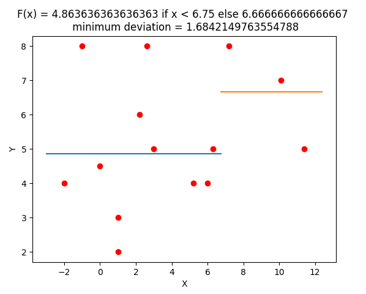

# Descriprion
    My simple web service to find best a. b. c for picewise defined function F.
    Done: Array of pairs [x, y] like [[1, 2], [2, 3], [3, 4]]
    Function F(x) = a if x < c else F(x) = b
    Need to find: best a, b, c which garantee minimal standart deviation for this pairs and F(x)

# Usage
1. You should clone this repository 
2. Create docker image *best_params* with command:   
***docker build -t best_params .***
3. You should run the container with command:
***docker run -p 8000:8000 best_params***
4. Now you can send ***POST*** request to the url: ***http://127.0.0.1:8000/best_params***
 The body should be JSON raw, the list if pairs like 
*[[1, 2], [1, 3], [3, 5], [5.2, 4], [6, 4], [6.3, 5], [2.6, 8], [11.4, 5], [10.1, 7], [7.2, 8], [2.2, 6], [0, 4.5], [-1, 8], [-2, 4]]*

***CURL EXAMPLE***: 
```
curl --location 'http://127.0.0.1:8000/best_params' \
--header 'Content-Type: application/json' \
--data '[[1, 2], [1, 3], [3, 5], [5.2, 4], [6, 4], [6.3, 5], [2.6, 8], [11.4, 5], [10.1, 7], [7.2, 8], [2.2, 6], [0, 4.5], [-1, 8], [-2, 4]]'
```

***EXPECTED RESPONSE***
Image in format PNG showing the solution. Custom headers x-a, x-b, x-c with values. 
 
PNG exammple:

